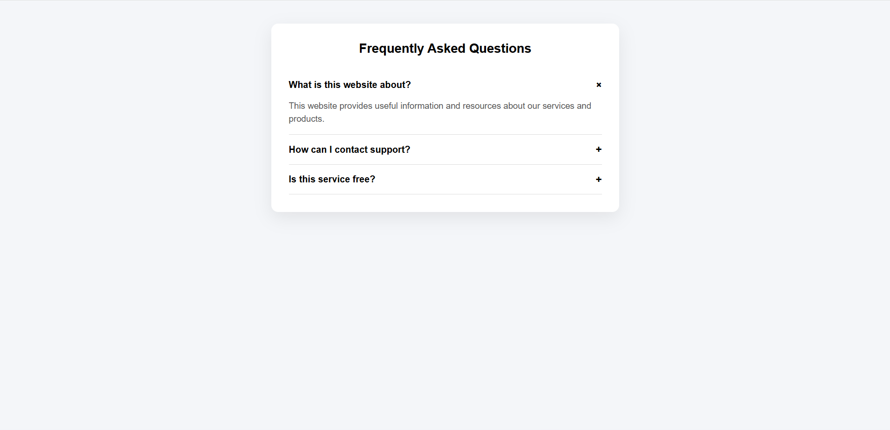

# Project 2 - FAQ Accordion Widget

A clean and professional FAQ Accordion component built using HTML, CSS, and JavaScript. This project allows users to expand and collapse answers smoothly with modern transition effects.

---

## 📸 Preview

  

---

## 📌 Features

- 📂 Collapsible FAQ items  
- 🔄 Toggle open/close state using JavaScript  
- ✨ Smooth CSS transition animations  
- 📱 Fully responsive design  
- 🎨 Simple and professional UI  

---

## ⚙️ How It Works

- Users click on a question to expand the answer.
- Clicking the question again collapses the answer.
- Only one FAQ item can stay open at a time (optional feature if implemented).
- Animations are handled using CSS transitions.
- Open/close logic is managed using JavaScript class toggling.

---

## 🛠 Tech Stack

- HTML
- CSS
- JavaScript

---

## 👩‍💻 Author

Created by **Ummu Husnul**
